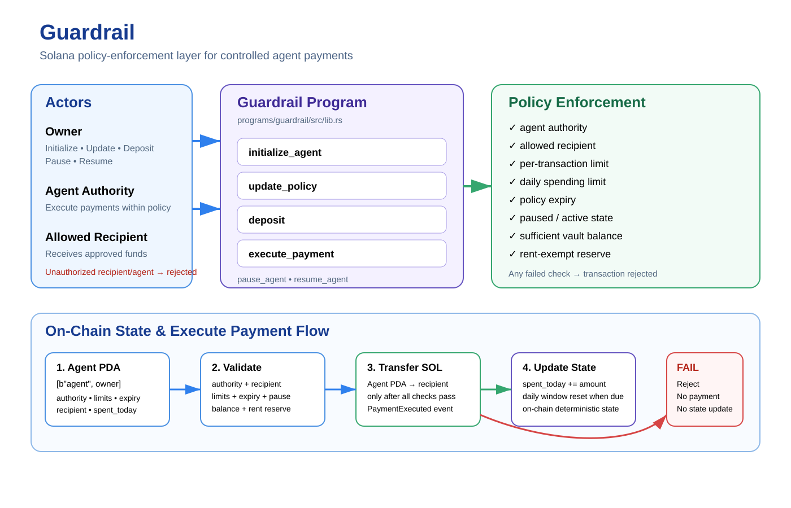

# Guardrail

Guardrail is a Solana/Anchor security MVP for enforcing policy-controlled payments made by an authorized agent.

## Overview

Guardrail places explicit limits around agent-controlled SOL payments:

- owner authorization
- configured agent authorization
- allowed recipient
- per-transaction limit
- daily spending limit
- policy expiry
- pause/resume controls
- vault balance and rent-reserve protection
- payment execution event

The goal is to make payment execution deterministic: a payment is executed only when all configured policy checks pass.

## Architecture



Guardrail separates policy management from payment execution. The owner configures the policy and funds the vault, while the configured agent authority can execute payments only when the on-chain policy checks pass.

### Execute Payment Flow

1. **Validate authorization** — the configured agent authority must sign the payment request.
2. **Validate policy** — pause state, expiry, recipient allowlist, per-transaction limit, and daily spending limit are checked.
3. **Validate vault balance** — the payment must leave the required rent-exempt reserve.
4. **Transfer funds** — SOL moves from the agent PDA to the allowed recipient.
5. **Update state** — daily spending state is updated and a `PaymentExecuted` event is emitted.

Any failed policy check rejects the transaction before the payment is executed.

## Core Instructions

### `initialize_agent`
Creates the agent policy account and configures:

- agent authority
- maximum payment per transaction
- daily spending limit
- allowed recipient
- policy expiry

The policy account is derived as a PDA using:

```text
[b"agent", owner_pubkey]
```

### `update_policy`
Owner-only policy update. The same core validation rules apply to transaction and daily limits and expiry.

### `deposit`
Allows the owner to deposit SOL into the agent vault.

### `execute_payment`
Executes a SOL payment only after policy enforcement succeeds.

Checks include:

1. amount is greater than zero
2. agent is not paused
3. policy has not expired
4. caller matches the configured agent authority
5. recipient matches the allowed recipient
6. amount does not exceed the per-transaction limit
7. daily spending limit is not exceeded
8. vault retains the required rent reserve
9. payment is applied and the daily spending counter is updated

Successful payments emit a `PaymentExecuted` event.

### `pause_agent`
Owner-only emergency pause.

### `resume_agent`
Owner-only resume operation.

## Security Model

| Control | Purpose |
|---|---|
| Owner authorization | Restricts policy management to the configured owner |
| Agent authorization | Restricts payments to the configured agent authority |
| Recipient allowlist | Prevents payments to an unexpected recipient |
| Per-Tx limit | Caps the size of an individual payment |
| Daily limit | Caps aggregate daily spending |
| Expiry | Stops payments after the policy expires |
| Pause | Provides an owner-controlled emergency stop |
| Vault balance check | Prevents spending into the account's rent reserve |
| Payment event | Provides an on-chain record of successful payments |

## Test Coverage

The integration test covers both successful execution and policy-enforcement failures:

| Test | Result |
|---|---|
| Initialize agent | PASS |
| Deposit 5 SOL | PASS |
| Valid payment | PASS |
| Wrong recipient rejected | PASS |
| Per-transaction limit enforced | PASS |
| Unauthorized agent rejected | PASS |
| Daily limit enforced | PASS |
| Pause blocks payment | PASS |
| Resume agent | PASS |
| Unauthorized owner rejected | PASS |
| Expired policy rejected | PASS |
| Zero transaction limit rejected | PASS |
| Daily limit below transaction limit rejected | PASS |
| Already-expired policy rejected | PASS |
| Insufficient vault balance rejected | PASS |

The latest live local-validator run completed with:

```text
======================================
ALL GUARDRAIL TESTS PASSED
======================================

test guardrail_policy_enforcement ... ok

test result: ok. 1 passed; 0 failed; 0 ignored; 0 measured; 0 filtered out; finished in 138.39s
```

The suite validates the core payment path as well as authorization, recipient restrictions, spending limits, pause/resume behavior, policy expiry, invalid policy configuration, and vault-balance protection.

## Verification

Run formatting checks:

```bash
cargo fmt --all -- --check
```

Run Clippy with warnings denied:

```bash
cargo clippy --workspace --all-targets -- -D warnings
```

Run the Guardrail integration test:

```bash
cargo test --test test_guardrail -- --nocapture
```

For a clean deterministic test run, reset the local validator before deployment:

```bash
pkill -9 -f solana-test-validator
sleep 2
solana-test-validator --reset
```

Then, from the repository root:

```bash
anchor build
anchor program deploy
cargo test --test test_guardrail -- --nocapture
```

For local development, the program must be deployed to the local validator before running the integration test:

```bash
anchor build
anchor deploy
```

If the local validator contains an existing deterministic agent PDA, restart it with a reset before redeploying:

```pkill -f solana-test-validator
solana-test-validator --reset
```

## Program ID

```text
HP8ptgh4CDEwgR7rSESkfR4ZxyrLcg5VfkossDLwU5RS
```

## Current Scope

This MVP focuses on policy-controlled SOL payments.

It does not currently implement:

- SPL token payments
- multisignature governance
- multiple recipient policies
- complex role systems
- off-chain monitoring
- formal verification

These can be added as future extensions.

## License

MIT
